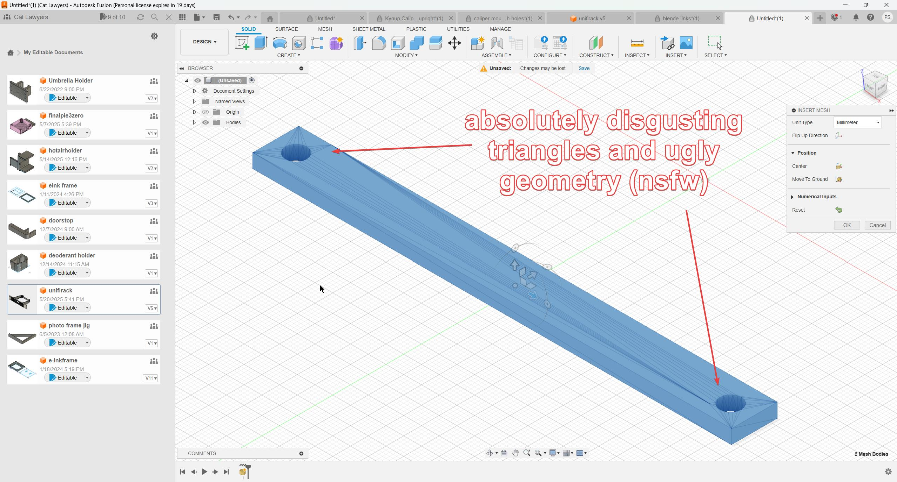
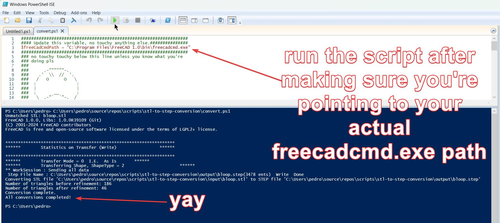
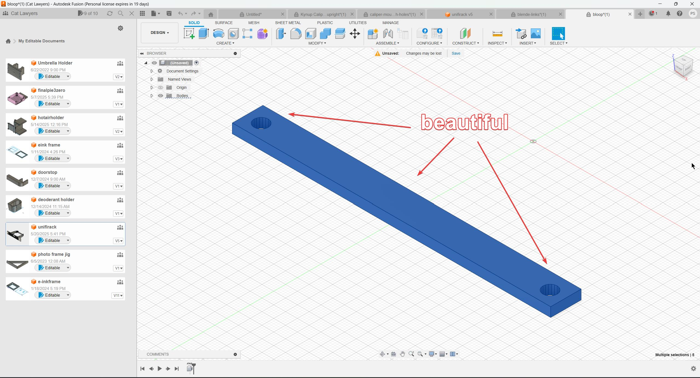

## STL to STEP Conversion Script

This is for the hobbyist 3D printing enthusiast that likes to use Fusion 360 but doesn't pay for a professional license. You may be aware that certain limitations come with the hobbyist license, specifically, **_prismatic mesh conversion_**. The consequence of that is that when you want to edit an STL file inside of Fusion 360, it turns it into an a true triangle king.

You can avoid this by using FreeCAD (open source alternative to Fusion 360), as it will convert an STL to a STEP for you and simplify the geometry greatly, making it MUCH easier to edit the model. I tried switching to FreeCAD and I'm just too old and grouchy to learn something new, so I gave up.

To that end, I've created a script that will use freecadcmd.exe, a tool provided in FreeCAD 1.0 for the purpose of automating things in FreeCAD. It is [available for download here](https://www.freecad.org/downloads.php).

### How to Use

Put .STL files you want converted inside the input folder. Open the _convert.ps1_ PowerShell script using "PowerShell ISE."

Make sure you updated the freecadcmd.exe path to point at wherever it actually is in your system. You may not need to change it if you installed it in the default path. Then just run the script. Hopefully it works and stuff. The model I used in this sample is included in the path for testing.

I hope it's useful and I really, really hope there wasn't some much easier solution already out there. There probably was. Don't tell me if there is, it'll hurt too much.
